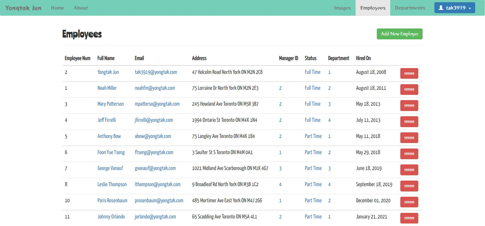
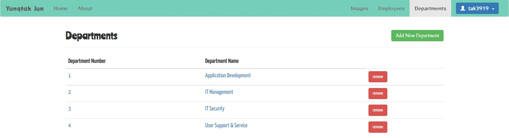

# Employees Management Application

The Employees Management Application is an application that makes employee management efficient and easy, and you can easily add new employees or departments through the Employees Management Application.

### Live Demo

https://employees-management1.herokuapp.com/

### Screenshots

- Employees page

  

- Departments page

  

### Key Features

- This application is designed to be used only when you log in.
- If you click on an employee's name, you can view the employee's detailed information and edit the information.
- If you click on the Manager ID, Status (Full time, or Part time) or Department number, you can see only the corresponding employees.
- This application manages employee information through postgreSQL. Also, a login function was installed through MongoDB.

### Technologies

- Nodejs (Express)
- Postgres
- MongoDB
- Handlebars.js, Sessions, Bcrypt, Multer, etc.
